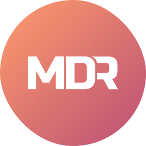

<!-- PROJECT LOGO -->
<br />
<p align="center">
  <a href="https://github.com/adi.sreyaj/md-resume">
    
  </a>

  <h3 align="center">MDResume - Simple Markdown Resume</h3>

  <p align="center">
    Create PDF and HTML versions of resume by authoring in Markdown.
    <br />
    <br />
    <a href="https://md-resume.adi.so">View Demo</a>
    ·
    <a href="https://github.com/adisreyaj/md-resume/issues">Report Bug</a>
    ·
    <a href="https://github.com/adisreyaj/md-resume/issues">Request Feature</a>
  </p>

  <p align="center">
   
   
  </p>
</p>


Write your resume in markdown and easily get the PDF and HTML. Keep your resumes up to date with ease. Write your resume one time and just update as and when needed. Don't go through the hassle of creating a resume every time.

## Features


✅ Super simple to use.

✅ Markdown is a really great way to store content. It works well for resumes as well. We can write it once and then update it whenever without having to mess with positioning or online tools.

✅ **Download as PDF**.
Once you are happy with the results, hit the **Print** button to create a PDF of the resume.

✅ **Download as HTML**.
You can download the resume as a single HTML file with inlined styles. Just push to any web server and now you have a responsive resume hosted on the internet.

## Under the hood

  <p align="center">
  
  </p>

🔸 The main application is written in **TypeScript** without using any frameworks. **Vite** takes care of bundling.

🔸 You can see React mentioned in the stack as its used for the templates used for rendering the resumes.

🔸 **Markdown** is parsed to extract different meta data like education, skills, work experience etc. A JSON object will be the final output after parsing the markdown.

🔸 All the parsing is done inside a **Web Worker**.

🔸 This JSON object is received as prop in the theme, which is a React component. Then the react template is compiled to static markup using the `renderToStaticMarkup` from `react-dom/server` package.

🔸 Once the rendering is complete, the compiled HTML is received which is then attached to the DOM.

### Themes

The idea of the project is to support multiple themes will can be authored in React. Users can then select the theme and build the resume using it.

Styling should be done using **TailwindCSS**. All the classes used in the themes will be extracted into a CSS file which is later used.

The styles for the selected theme is fetched and then attached to the head in the Runtime.

## Running Locally

1. Clone or download the repository

```sh
git clone https://github.com/adisreyaj/md-resume.git
```

2. Install the dependencies

```sh
npm i
```

3. Build theme styles

```sh
npm run build:themes
```

4. Run the local dev server

```sh
npm run dev
```

## Roadmap

See the [open issues](https://github.com/adisreyaj/md-resume/issues) for a list of proposed features (and known issues).

## License

Distributed under the MIT License. See `LICENSE` for more information.

## Show your support

Please ⭐️ this repository if this project helped you!
